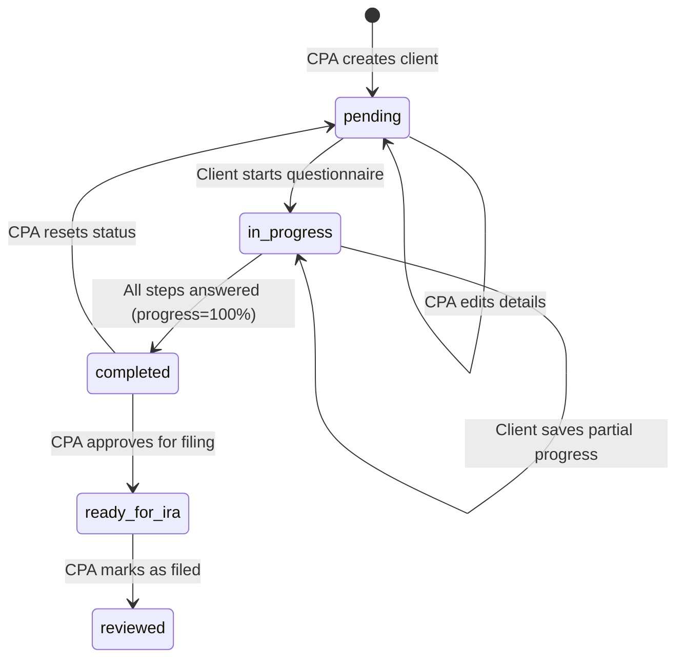
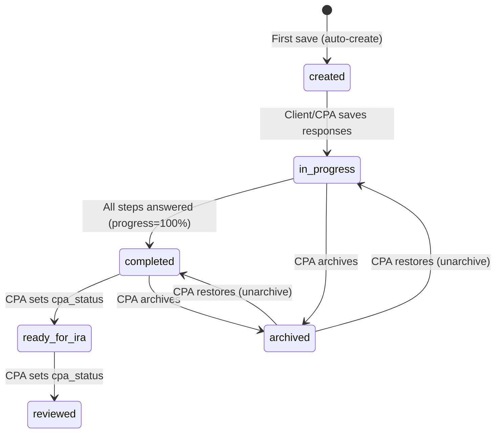
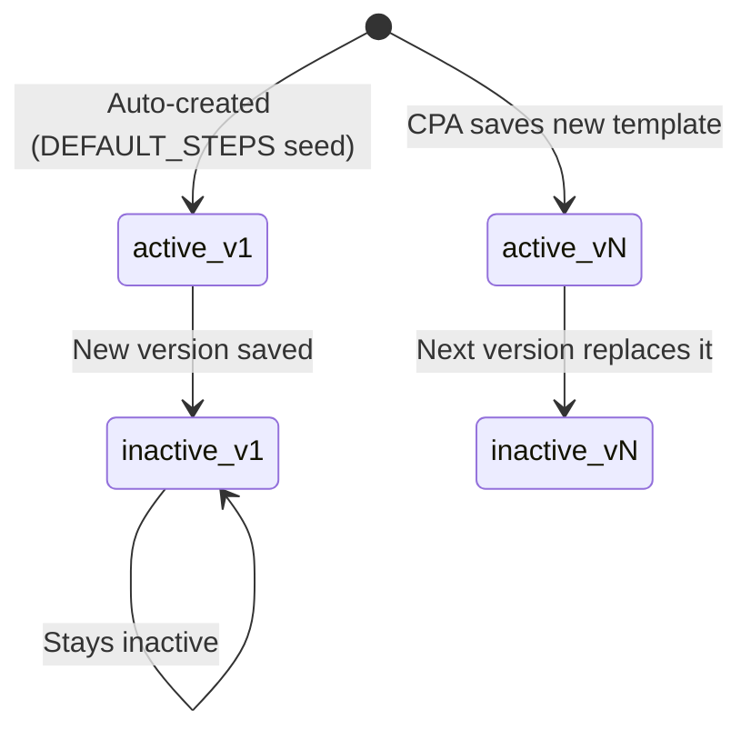

# 03 — Entity Lifecycles

> **Status:** COMPLETE
> **Classification:** All ✅ VERIFIED unless noted

---

## 1. Client Entity

### State Diagram

### CRUD Operations

| Operation | Actor | Function / Code | Evidence |
|---|---|---|---|
| **CREATE** | CPA | `base44.entities.Client.create()` | [ClientsPage.jsx](file:///c:/Users/ntzur/workspace-antigravity/auditflow/src/pages/ClientsPage.jsx) — add client form |
| **READ** | CPA | `base44.entities.Client.list()`, `.filter()` | [CpaDashboard.jsx](file:///c:/Users/ntzur/workspace-antigravity/auditflow/src/pages/CpaDashboard.jsx) |
| **READ** | CLIENT | `getClientByToken` | [entry.ts:12](file:///c:/Users/ntzur/workspace-antigravity/auditflow/base44/functions/getClientByToken/entry.ts#L12) |
| **UPDATE** (status) | CLIENT (indirect) | `updateClientSubmission` → updates `last_activity`, `status` | [entry.ts:59-64](file:///c:/Users/ntzur/workspace-antigravity/auditflow/base44/functions/updateClientSubmission/entry.ts#L59) |
| **UPDATE** (status) | CPA | `cpaSaveSubmission` → updates `last_activity`, `status` | [entry.ts:77-80](file:///c:/Users/ntzur/workspace-antigravity/auditflow/base44/functions/cpaSaveSubmission/entry.ts#L77) |
| **UPDATE** (status) | CPA | `ClientRow` → "אשר להגשה לרמ״ש" / "סמן כהוגש" buttons | [ClientRow.jsx:729-757](file:///c:/Users/ntzur/workspace-antigravity/auditflow/src/components/dashboard/ClientRow.jsx#L729) |
| **UPDATE** (details) | CPA | `EditClientModal` | [EditClientModal.jsx](file:///c:/Users/ntzur/workspace-antigravity/auditflow/src/components/dashboard/EditClientModal.jsx) |
| **UPDATE** (token) | CPA | `ClientRow.regenerateToken()` | [ClientRow.jsx:207-213](file:///c:/Users/ntzur/workspace-antigravity/auditflow/src/components/dashboard/ClientRow.jsx#L207) |
| **UPDATE** (tax_year) | CPA | `ClientRow.handleChangeYear()` | [ClientRow.jsx:138-154](file:///c:/Users/ntzur/workspace-antigravity/auditflow/src/components/dashboard/ClientRow.jsx#L138) |
| **UPDATE** (status reset) | CPA | "איפוס סטטוס" button | [ClientRow.jsx:664-677](file:///c:/Users/ntzur/workspace-antigravity/auditflow/src/components/dashboard/ClientRow.jsx#L664) |
| **DELETE** | ❓ UNCERTAIN | No client deletion found in codebase | — |

### Key Fields and State Transitions

| Field | Values | Changed By |
|---|---|---|
| `status` | `pending` → `in_progress` → `completed` → `ready_for_ira` → `reviewed` | Client (indirect via function), CPA (direct) |
| `token` | 16-char random string | CPA (regenerate) |
| `tax_year` | Integer (e.g., 2024) | CPA (change year) |
| `osek_type` | `"עוסק מורשה"`, `"עוסק פטור"`, etc. | CPA (edit modal) |
| `last_activity` | ISO timestamp | Updated on every submission save |

---

## 2. Submission Entity

### State Diagram

### CRUD Operations

| Operation | Actor | Function / Code | Evidence |
|---|---|---|---|
| **CREATE** | CLIENT (auto) | `updateClientSubmission` — auto-creates if none exists for tax year | [entry.ts:42-55](file:///c:/Users/ntzur/workspace-antigravity/auditflow/base44/functions/updateClientSubmission/entry.ts#L42) |
| **CREATE** | CPA (auto) | `cpaSaveSubmission` — auto-creates if none exists | [entry.ts:62-73](file:///c:/Users/ntzur/workspace-antigravity/auditflow/base44/functions/cpaSaveSubmission/entry.ts#L62) |
| **READ** | CLIENT | Via `getClientByToken` response | [entry.ts:25-26](file:///c:/Users/ntzur/workspace-antigravity/auditflow/base44/functions/getClientByToken/entry.ts#L25) |
| **READ** | CPA | `base44.entities.Submission.list()`, `.filter()` | [CpaDashboard.jsx](file:///c:/Users/ntzur/workspace-antigravity/auditflow/src/pages/CpaDashboard.jsx) |
| **UPDATE** (responses) | CLIENT | `updateClientSubmission` | [entry.ts:31](file:///c:/Users/ntzur/workspace-antigravity/auditflow/base44/functions/updateClientSubmission/entry.ts#L31) |
| **UPDATE** (responses) | CPA | `cpaSaveSubmission` | [entry.ts:60](file:///c:/Users/ntzur/workspace-antigravity/auditflow/base44/functions/cpaSaveSubmission/entry.ts#L60) |
| **UPDATE** (cpa_status) | CPA | `ClientRow` status buttons | [ClientRow.jsx:735,749](file:///c:/Users/ntzur/workspace-antigravity/auditflow/src/components/dashboard/ClientRow.jsx#L735) |
| **UPDATE** (is_archived) | CPA | "ארכב הגשה" / "שחזר הגשה" buttons | [ClientRow.jsx:629-662](file:///c:/Users/ntzur/workspace-antigravity/auditflow/src/components/dashboard/ClientRow.jsx#L629) |
| **UPDATE** (alert_sent) | SYSTEM | `notifySubmissionCompleted` | [entry.ts:75-77](file:///c:/Users/ntzur/workspace-antigravity/auditflow/base44/functions/notifySubmissionCompleted/entry.ts#L75) |
| **DELETE** | CPA | `deleteSubmissionWithFiles` | [entry.ts:60](file:///c:/Users/ntzur/workspace-antigravity/auditflow/base44/functions/deleteSubmissionWithFiles/entry.ts#L60) |

### Key Fields

| Field | Purpose | Format |
|---|---|---|
| `responses` | All step answers, files, text | JSON string: `{"stepId": {"answer": bool, "files": [], "text": "", "selected": []}}` |
| `signed_pdfs` | Signed PDF records | JSON string: `[{"step_id", "pdf_file_url", "template_name", "step_title", "incomplete"}]` |
| `step_completed` | Last completed step index | Integer |
| `cpa_status` | CPA-set workflow status | `null`, `"ready_for_ira"`, `"reviewed"` |
| `cpa_audit_log` | CPA fill audit trail | JSON string: `[{"cpa_email", "cpa_name", "step_id", "timestamp", "action"}]` |
| `is_archived` | Soft-delete flag | Boolean |
| `alert_sent` | Telegram alert sent flag | Boolean |

### Archived Submission Recovery

When restoring an archived submission, if an active (non-archived) submission exists for the same tax year, a `RestoreSubmissionDialog` is shown offering to swap them.

**Evidence:** [ClientRow.jsx:644-662](file:///c:/Users/ntzur/workspace-antigravity/auditflow/src/components/dashboard/ClientRow.jsx#L644)

---

## 3. QuestionnaireTemplate Entity

### Lifecycle

### CRUD Operations

| Operation | Actor | Function / Code | Evidence |
|---|---|---|---|
| **CREATE** (seed) | SYSTEM | `getActiveTemplate` — auto-creates v1 if none exists | [entry.ts:120-127](file:///c:/Users/ntzur/workspace-antigravity/auditflow/base44/functions/getActiveTemplate/entry.ts#L120) |
| **CREATE** (new version) | CPA | `saveQuestionnaireTemplate` — deactivates all, creates new | [entry.ts:20-37](file:///c:/Users/ntzur/workspace-antigravity/auditflow/base44/functions/saveQuestionnaireTemplate/entry.ts#L20) |
| **READ** | Any | `getActiveTemplate`, `getTemplateById`, `getAllTemplateVersions` | Various |
| **UPDATE** | CPA | `saveQuestionnaireTemplate` deactivates old versions | [entry.ts:24-29](file:///c:/Users/ntzur/workspace-antigravity/auditflow/base44/functions/saveQuestionnaireTemplate/entry.ts#L24) |
| **DELETE** | ❓ UNCERTAIN | No template deletion found | — |

### Versioning Rules
- Only one template can be `is_active: true` at a time
- Old versions are preserved (deactivated) for historical reference
- Submissions link to templates via `template_id`

---

## 4. PdfTemplate Entity

### CRUD Operations

| Operation | Actor | Function / Code | Evidence |
|---|---|---|---|
| **CREATE** | CPA | ⚠️ INFERRED — via Base44 entity editor or custom UI | Not found in audited frontend code |
| **READ** | CLIENT | `getActivePdfTemplates`, `getPdfTemplateById` | [entry.ts](file:///c:/Users/ntzur/workspace-antigravity/auditflow/base44/functions/getActivePdfTemplates/entry.ts) |
| **READ** | CPA | `base44.entities.PdfTemplate.list()` in `QuestionnaireEditor` | [QuestionnaireEditor.jsx:86](file:///c:/Users/ntzur/workspace-antigravity/auditflow/src/components/dashboard/QuestionnaireEditor.jsx#L86) |
| **UPDATE** | CPA | ⚠️ INFERRED — via Base44 entity editor | Not found in audited frontend code |
| **DELETE** | CPA | ⚠️ INFERRED — via Base44 entity editor | **Known bug:** [OPEN_BUGS.md](file:///c:/Users/ntzur/workspace-antigravity/auditflow/OPEN_BUGS.md) — ghost references |

### Known Issue
Deleting a PdfTemplate does not cascade to QuestionnaireTemplate steps that reference it. This leaves "ghost" references causing `"Template not found"` errors in the signing flow.

---

## 5. SyncedDriveFile Entity

### CRUD Operations

| Operation | Actor | Function / Code | Evidence |
|---|---|---|---|
| **CREATE** | SYSTEM (via CPA action) | `syncFilesToGoogleDrive` → `syncFile()` | [entry.ts:156-163](file:///c:/Users/ntzur/workspace-antigravity/auditflow/base44/functions/syncFilesToGoogleDrive/entry.ts#L156) |
| **READ** | SYSTEM | `syncFilesToGoogleDrive` — checks for duplicates | [entry.ts:210,316](file:///c:/Users/ntzur/workspace-antigravity/auditflow/base44/functions/syncFilesToGoogleDrive/entry.ts#L210) |
| **UPDATE** | ❌ | Not updated after creation | — |
| **DELETE** | ❌ | Not deleted | — |

### Purpose
Prevents re-uploading the same file to Google Drive. Acts as an idempotency ledger.

---

## 6. User Entity

### CRUD Operations

| Operation | Actor | Function / Code | Evidence |
|---|---|---|---|
| **CREATE** | Base44 platform | User registration (external) | — |
| **READ** | CPA | `base44.auth.me()` | [AuthContext.jsx](file:///c:/Users/ntzur/workspace-antigravity/auditflow/src/lib/AuthContext.jsx) |
| **UPDATE** (drive_base_path) | CPA | `base44.auth.updateMe()` in Settings | [Settings.jsx:52](file:///c:/Users/ntzur/workspace-antigravity/auditflow/src/pages/Settings.jsx#L52) |
| **DELETE** | Base44 platform | — | — |
