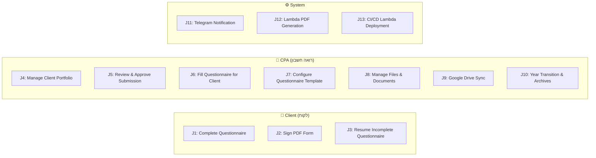
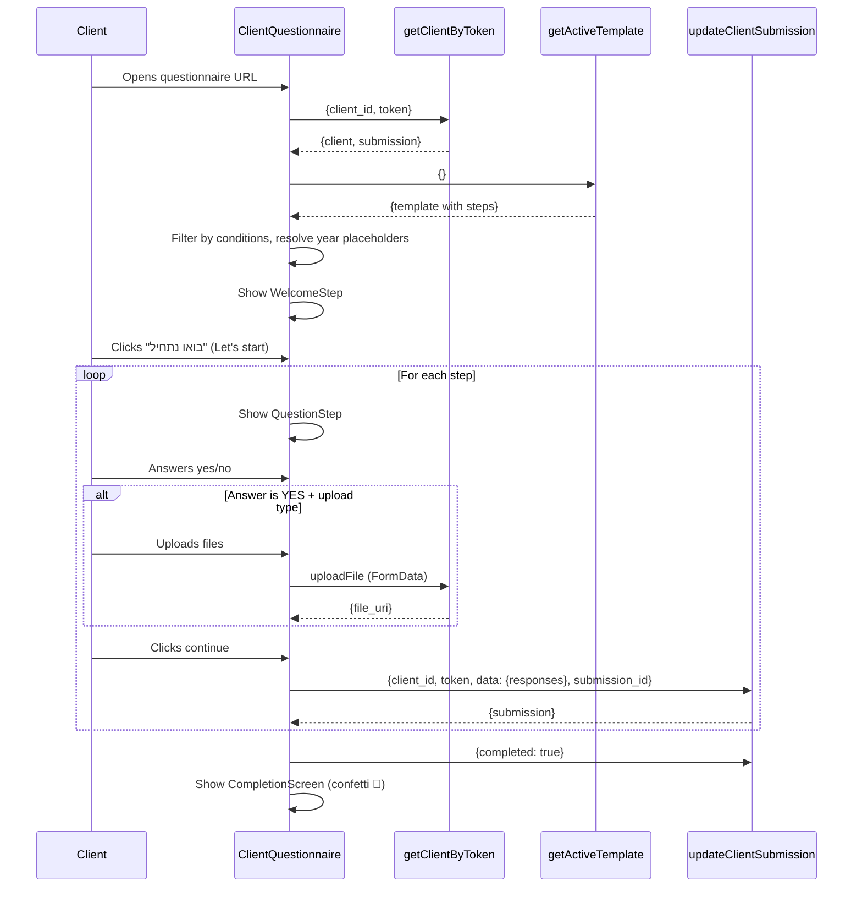
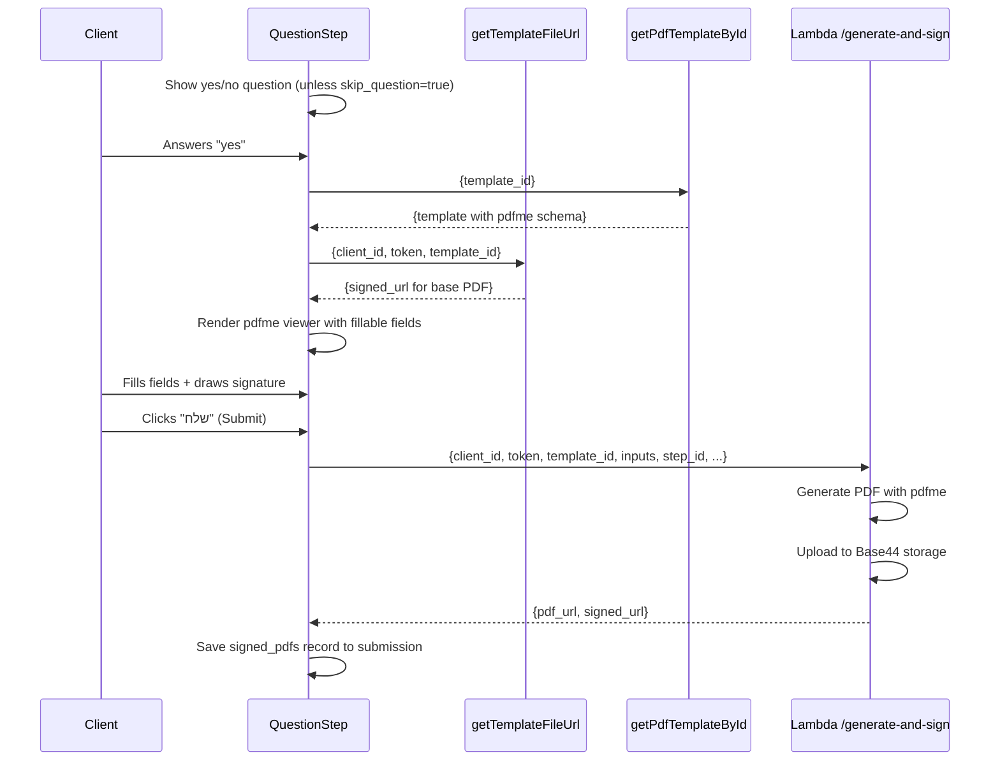
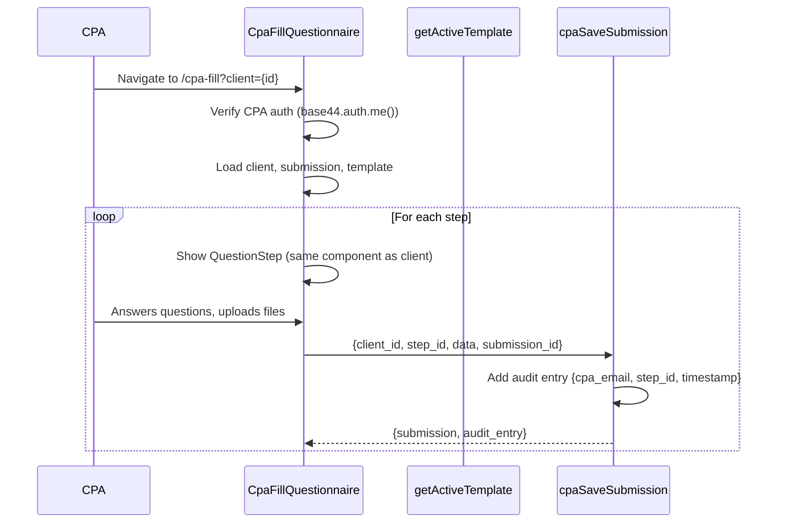

# 04 — User Journeys

> **Status:** COMPLETE
> **Classification:** All ✅ VERIFIED unless noted

---

## Journey Map Overview



---

## J1: Client Completes Tax Document Questionnaire

**Actor:** CLIENT
**Goal:** Submit all required tax documents and information for the CPA
**Entry point:** URL with `client_id` + `token` (shared by CPA via link)

### Flow



### Scenarios

| ID | Scenario | Condition | Evidence |
|---|---|---|---|
| J1-S1 | **Happy path** — all steps answered, files uploaded | Client answers all questions | [ClientQuestionnaire.jsx](file:///c:/Users/ntzur/workspace-antigravity/auditflow/src/pages/ClientQuestionnaire.jsx) |
| J1-S2 | **Skip step** — client answers "no" | `answer === false` | [QuestionStep.jsx:117](file:///c:/Users/ntzur/workspace-antigravity/auditflow/src/components/questionnaire/QuestionStep.jsx#L117) |
| J1-S3 | **Conditional step hidden** — pension for עוסק פטור | `filterStepsByClientConditions()` | [questionnaire-template.js:245-262](file:///c:/Users/ntzur/workspace-antigravity/auditflow/src/lib/questionnaire-template.js#L245) |
| J1-S4 | **Text response** — additional income description | `response_type === "text"` | [QuestionStep.jsx:125-126](file:///c:/Users/ntzur/workspace-antigravity/auditflow/src/components/questionnaire/QuestionStep.jsx#L125) |
| J1-S5 | **Single/multi select** — income sources | `response_type === "single_select" \| "multi_select"` | [QuestionStep.jsx:127-128](file:///c:/Users/ntzur/workspace-antigravity/auditflow/src/components/questionnaire/QuestionStep.jsx#L127) |
| J1-S6 | **Invalid/expired token** | Token mismatch → 403 error | [getClientByToken/entry.ts:20-21](file:///c:/Users/ntzur/workspace-antigravity/auditflow/base44/functions/getClientByToken/entry.ts#L20) |
| J1-S7 | **Client not found** | Invalid client_id → 404 error | [getClientByToken/entry.ts:14-15](file:///c:/Users/ntzur/workspace-antigravity/auditflow/base44/functions/getClientByToken/entry.ts#L14) |
| J1-S8 | **Archived submission** | 409 response → client must reload | [updateClientSubmission/entry.ts:34](file:///c:/Users/ntzur/workspace-antigravity/auditflow/base44/functions/updateClientSubmission/entry.ts#L34) |
| J1-S9 | **WhatsApp in-app browser** | localStorage unavailable → in-memory fallback | [app-params.js:4-23](file:///c:/Users/ntzur/workspace-antigravity/auditflow/src/lib/app-params.js#L4) |
| J1-S10 | **Legacy submission format** | Old flat-field → converted by `getResponses()` | [submission-compat.js:74-92](file:///c:/Users/ntzur/workspace-antigravity/auditflow/src/lib/submission-compat.js#L74) |

---

## J2: Client Signs PDF Form

**Actor:** CLIENT
**Goal:** Fill and sign a PDF form as part of the questionnaire
**Trigger:** Reaching a step with `response_type === "pdf_sign"`

### Flow



### Scenarios

| ID | Scenario | Condition | Evidence |
|---|---|---|---|
| J2-S1 | **Happy path** — PDF signed and generated | All fields filled | [ClientQuestionnaire.jsx](file:///c:/Users/ntzur/workspace-antigravity/auditflow/src/pages/ClientQuestionnaire.jsx) |
| J2-S2 | **Skip question** — auto-show PDF (no yes/no) | `skip_question === true` | [questionnaire-steps.js:14](file:///c:/Users/ntzur/workspace-antigravity/auditflow/src/lib/questionnaire-steps.js#L14) |
| J2-S3 | **Client declines** — answers "no" to PDF step | `answer === false`, no signing UI | [QuestionStep.jsx:151-152](file:///c:/Users/ntzur/workspace-antigravity/auditflow/src/components/questionnaire/QuestionStep.jsx#L151) |
| J2-S4 | **Incomplete signing** — not all fields filled | `incomplete: true` in signed_pdfs record | ⚠️ INFERRED from `incomplete` field usage in [ClientRow.jsx:379,394](file:///c:/Users/ntzur/workspace-antigravity/auditflow/src/components/dashboard/ClientRow.jsx#L379) |
| J2-S5 | **Ghost template** — PDF template deleted | 404 from `getPdfTemplateById` | [OPEN_BUGS.md](file:///c:/Users/ntzur/workspace-antigravity/auditflow/OPEN_BUGS.md) |
| J2-S6 | **Lambda cold start** | ~2.4s init, 8-15s total flow | Known gotcha from AGENTS.md |
| J2-S7 | **CPA exempts PDF step** — CPA marks as "not required" | CPA fill flow only; `exempted_by_cpa: true` in signed_pdfs record | [CpaFillQuestionnaire.jsx:164-196](file:///c:/Users/ntzur/workspace-antigravity/auditflow/src/pages/CpaFillQuestionnaire.jsx#L164) |

---

## J3: Client Resumes Incomplete Questionnaire

**Actor:** CLIENT
**Goal:** Continue a previously started questionnaire
**Trigger:** Client re-opens questionnaire URL

### Flow
1. `getClientByToken` returns existing submission
2. `getResumeStepIndex()` calculates first unanswered step
3. Client is navigated directly to that step (skipping welcome + answered steps)

### Resume Logic
- **Source:** [questionnaire-steps.js:40-68](file:///c:/Users/ntzur/workspace-antigravity/auditflow/src/lib/questionnaire-steps.js#L40)
- For each step: checks if `responses[stepId].answer !== undefined` (or `signedPdfsById[stepId]` for PDF steps)
- If `step_completed` is ahead of first unanswered (race condition), trusts `step_completed`
- If all steps answered, navigates to "done" screen

### Scenarios

| ID | Scenario | Condition |
|---|---|---|
| J3-S1 | Resume at first unanswered step | Normal case |
| J3-S2 | All steps complete → show done screen | `firstUnanswered === null` |
| J3-S3 | Race condition — step_completed ahead | `stepCompletedIndex >= firstUnanswered` |
| J3-S4 | Step navigation via StepSelector | Client clicks on specific step in the progress bar |

---

## J4: CPA Manages Client Portfolio

**Actor:** CPA
**Goal:** Create, view, edit, and organize clients

### Sub-journeys

#### J4a: Add New Client
- **Page:** `/clients` → [ClientsPage.jsx](file:///c:/Users/ntzur/workspace-antigravity/auditflow/src/pages/ClientsPage.jsx)
- **Action:** Fill form → `base44.entities.Client.create()`
- **Fields:** full_name, email, phone, osek_type, tax_year, pricing

#### J4b: Edit Client Details
- **Trigger:** "עריכת פרטים" button in ClientRow
- **Component:** [EditClientModal.jsx](file:///c:/Users/ntzur/workspace-antigravity/auditflow/src/components/dashboard/EditClientModal.jsx)
- **Action:** `base44.entities.Client.update()`

#### J4c: Generate/Copy Questionnaire Link
- **Trigger:** "לינק" button in ClientRow
- **Action:** Copy `{origin}/questionnaire?client={id}&token={token}` to clipboard
- **Edge case:** If token is missing, auto-generates one first
- **Evidence:** [ClientRow.jsx:191-205](file:///c:/Users/ntzur/workspace-antigravity/auditflow/src/components/dashboard/ClientRow.jsx#L191)

#### J4d: View Client Submission Details
- **Trigger:** Click to expand ClientRow
- **Shows:** Progress breakdown, file list, signed PDFs, text responses, last activity
- **Year tabs:** Switch between multiple tax year submissions
- **Evidence:** [ClientRow.jsx:294-761](file:///c:/Users/ntzur/workspace-antigravity/auditflow/src/components/dashboard/ClientRow.jsx#L294)

#### J4e: Regenerate Token
- **Trigger:** Click "תקן לינק" when token is missing
- **Action:** Generate new random token → update client → copy new link
- **Evidence:** [ClientRow.jsx:207-213](file:///c:/Users/ntzur/workspace-antigravity/auditflow/src/components/dashboard/ClientRow.jsx#L207)

---

## J5: CPA Reviews & Approves Submission

**Actor:** CPA
**Goal:** Move a completed submission through the review workflow

### Status Progression

```
completed → ready_for_ira → reviewed
```

### Actions

| Action | Button Label | New Status | Evidence |
|---|---|---|---|
| Approve for filing | "✓ אשר להגשה לרמ״ש" | `ready_for_ira` | [ClientRow.jsx:729-742](file:///c:/Users/ntzur/workspace-antigravity/auditflow/src/components/dashboard/ClientRow.jsx#L729) |
| Mark as filed | "✓ סמן כהוגש" | `reviewed` | [ClientRow.jsx:744-757](file:///c:/Users/ntzur/workspace-antigravity/auditflow/src/components/dashboard/ClientRow.jsx#L744) |
| Reset status | "איפוס סטטוס" | `pending` | [ClientRow.jsx:664-677](file:///c:/Users/ntzur/workspace-antigravity/auditflow/src/components/dashboard/ClientRow.jsx#L664) |

### Scenarios

| ID | Scenario | Condition |
|---|---|---|
| J5-S1 | **Happy path** — completed → ready_for_ira → reviewed | Normal workflow |
| J5-S2 | **Reset** — CPA resets completed client with no submission | Status returns to pending |
| J5-S3 | **Status override** — CPA sets status, but progress is still < 100% | ⚠️ INFERRED — `displayStatus` logic doesn't downgrade CPA-set statuses |

---

## J6: CPA Fills Questionnaire for Client

**Actor:** CPA
**Goal:** Fill the questionnaire on behalf of a client (e.g., client is elderly or unavailable)
**Page:** `/cpa-fill?client={id}`

### Flow



### Key Differences from Client Questionnaire

| Aspect | Client (J1) | CPA Fill (J6) |
|---|---|---|
| Auth | Token-based | Base44 JWT session |
| Save function | `updateClientSubmission` | `cpaSaveSubmission` |
| Audit trail | No | Yes — `cpa_audit_log` field |
| Welcome step | Shown | Skipped (starts at step 1) |
| Save queue | Per-step save | Sequential save queue (`saveQueue.ref`) |
| PDF sign steps | Client must sign in-browser | CPA can exempt ("סמן כלא נדרש") |

### PDF Sign Step Exemption (CPA-only)

When the CPA encounters a PDF signing step, they **cannot sign on behalf of the client**. Instead, they have two options:

1. **"סמן כלא נדרש (פטור רו״ח)"** — Mark the step as exempt. This creates a `signed_pdfs` record with `exempted_by_cpa: true` and an `audit_trail` object recording who exempted it and when. The step counts as complete, allowing the CPA to finish the questionnaire and move the submission to the next phase.
2. **"דלג לשלב הבא"** — Skip without exempting (step remains incomplete).

Once exempted, the step shows a blue confirmation state with a **"בטל פטור"** (undo) option.

#### Exemption Record Shape
```json
{
  "step_id": "...",
  "step_title": "...",
  "pdf_file_url": null,
  "exempted_by_cpa": true,
  "incomplete": false,
  "audit_trail": {
    "exempted_at": "2026-08-05T...",
    "exempted_by_cpa": true,
    "cpa_email": "cpa@example.com",
    "cpa_name": "רו״ח ישראלי"
  }
}
```

**Evidence:** [CpaFillQuestionnaire.jsx:164-196](file:///c:/Users/ntzur/workspace-antigravity/auditflow/src/pages/CpaFillQuestionnaire.jsx#L164)

### Audit Trail
- Each save records `{cpa_email, cpa_name, step_id, timestamp, action}` in the `cpa_audit_log` JSON field
- Displayed via `CpaAuditBadge` component in the dashboard
- **Evidence:** [cpaSaveSubmission/entry.ts:28-34](file:///c:/Users/ntzur/workspace-antigravity/auditflow/base44/functions/cpaSaveSubmission/entry.ts#L28)

### Scenarios

| ID | Scenario | Condition | Evidence |
|---|---|---|---|
| J6-S1 | **Happy path** — CPA fills all non-PDF steps | Normal flow | [CpaFillQuestionnaire.jsx](file:///c:/Users/ntzur/workspace-antigravity/auditflow/src/pages/CpaFillQuestionnaire.jsx) |
| J6-S2 | **PDF exempt** — CPA exempts a PDF sign step | Client signed outside platform | [CpaFillQuestionnaire.jsx:164-196](file:///c:/Users/ntzur/workspace-antigravity/auditflow/src/pages/CpaFillQuestionnaire.jsx#L164) |
| J6-S3 | **Undo exemption** — CPA reverts a previous exemption | CPA clicks "בטל פטור" | [CpaFillQuestionnaire.jsx:197-201](file:///c:/Users/ntzur/workspace-antigravity/auditflow/src/pages/CpaFillQuestionnaire.jsx#L197) |
| J6-S4 | **Skip PDF step** — CPA skips without exempting | Step remains incomplete | [CpaFillQuestionnaire.jsx](file:///c:/Users/ntzur/workspace-antigravity/auditflow/src/pages/CpaFillQuestionnaire.jsx) |
| J6-S5 | **Complete with exempt** — CPA reaches last step via exemption | Questionnaire completes, submission moves to next phase | [CpaFillQuestionnaire.jsx:186-189](file:///c:/Users/ntzur/workspace-antigravity/auditflow/src/pages/CpaFillQuestionnaire.jsx#L186) |

---

## J7: CPA Configures Questionnaire Template

**Actor:** CPA
**Goal:** Customize the questionnaire steps, add/remove questions, change response types
**Page:** `/settings` → Questionnaire Editor tab

### Capabilities

| Action | Evidence |
|---|---|
| Add new step | [QuestionnaireEditor.jsx](file:///c:/Users/ntzur/workspace-antigravity/auditflow/src/components/dashboard/QuestionnaireEditor.jsx) |
| Edit step (title, question, emoji, response type) | Same |
| Reorder steps (move up/down) | Same |
| Enable/disable steps | Same |
| Delete step | Same |
| Set conditions (e.g., show only for עוסק מורשה) | `updateCondition()` |
| Configure PDF sign step (link to PdfTemplate) | `updatePdfSignConfig()` |
| Preview questionnaire | ⚠️ INFERRED from Eye icon |
| Save as new version | `saveQuestionnaireTemplate` |

### Response Types Available

| Type | Label | Description |
|---|---|---|
| `upload` | העלאת קובץ | File upload (PDF, images) |
| `text` | תשובה טקסטית | Free-text input |
| `single_select` | בחירה יחידה | Radio-button selection |
| `multi_select` | בחירה מרובה | Checkbox selection |
| `pdf_sign` | חתימה על PDF | PDF form signing flow |
| `none` | כן/לא בלבד | Simple yes/no with no follow-up |

### Versioning
- Each save creates a **new version** (no in-place editing)
- Previous versions are deactivated but preserved
- Version history viewable via `getAllTemplateVersions`
- **Evidence:** [saveQuestionnaireTemplate/entry.ts:20-37](file:///c:/Users/ntzur/workspace-antigravity/auditflow/base44/functions/saveQuestionnaireTemplate/entry.ts#L20)

---

## J8: CPA Manages Files & Documents

**Actor:** CPA
**Goal:** View, preview, and download client-uploaded documents

### Sub-journeys

#### J8a: Preview File
- **Trigger:** Click on a file in the expanded ClientRow
- **Action:** Get signed URL → open `FilePreviewModal` (image viewer or PDF iframe)
- **Evidence:** [ClientRow.jsx:29-95](file:///c:/Users/ntzur/workspace-antigravity/auditflow/src/components/dashboard/ClientRow.jsx#L29)

#### J8b: Download Individual File
- **Trigger:** Download button on file row
- **Action:** Fetch signed URL → blob download → save to disk
- **Evidence:** [ClientRow.jsx:482-501](file:///c:/Users/ntzur/workspace-antigravity/auditflow/src/components/dashboard/ClientRow.jsx#L482)

#### J8c: Download All Files (ZIP)
- **Trigger:** "הורד הכל (ZIP)" button
- **Action:** Calls `downloadAllFiles` function → generates ZIP server-side → downloads
- **Evidence:** [ClientRow.jsx:156-187](file:///c:/Users/ntzur/workspace-antigravity/auditflow/src/components/dashboard/ClientRow.jsx#L156), [downloadAllFiles/entry.ts](file:///c:/Users/ntzur/workspace-antigravity/auditflow/base44/functions/downloadAllFiles/entry.ts)

#### J8d: View Signed PDFs
- **Trigger:** Signed PDF section in expanded ClientRow
- **Shows:** Status (signed vs incomplete), preview/download options
- **Evidence:** [ClientRow.jsx:511-590](file:///c:/Users/ntzur/workspace-antigravity/auditflow/src/components/dashboard/ClientRow.jsx#L511)

---

## J9: CPA Syncs Files to Google Drive

**Actor:** CPA
**Goal:** Synchronize client files to Google Drive for external access

### Sub-journeys

#### J9a: Connect Google Drive
- **Page:** `/settings`
- **Action:** OAuth popup → `base44.connectors.connectAppUser()` → check connection
- **Evidence:** [Settings.jsx:56-69](file:///c:/Users/ntzur/workspace-antigravity/auditflow/src/pages/Settings.jsx#L56)

#### J9b: Disconnect Google Drive
- **Action:** `base44.connectors.disconnectAppUser()`
- **Evidence:** [Settings.jsx:71-75](file:///c:/Users/ntzur/workspace-antigravity/auditflow/src/pages/Settings.jsx#L71)

#### J9c: Set Drive Base Path
- **Action:** Input base folder path → `base44.auth.updateMe({drive_base_path})`
- **Evidence:** [Settings.jsx:50-54](file:///c:/Users/ntzur/workspace-antigravity/auditflow/src/pages/Settings.jsx#L50)

#### J9d: Sync Single Client
- **Trigger:** "סנכרן לדרייב" button in ClientRow
- **Action:** `syncFilesToGoogleDrive({submission_id, client_id})`
- **Folder structure:** `{basePath}/{clientName}/{taxYear}/{stepTitle}/`
- **Evidence:** [ClientRow.jsx:700-725](file:///c:/Users/ntzur/workspace-antigravity/auditflow/src/components/dashboard/ClientRow.jsx#L700)

#### J9e: Sync All Clients (Batch)
- **Trigger:** "סנכרון כל ההגשות" button in Settings
- **Action:** `syncFilesToGoogleDrive({sync_all: true, submission_ids: [...]})`
- **Evidence:** [SyncAllDriveButton.jsx](file:///c:/Users/ntzur/workspace-antigravity/auditflow/src/components/dashboard/SyncAllDriveButton.jsx)

### Idempotency
- `SyncedDriveFile` entity tracks synced files
- Re-running sync skips already-uploaded files
- **Evidence:** [syncFilesToGoogleDrive/entry.ts:109,148](file:///c:/Users/ntzur/workspace-antigravity/auditflow/base44/functions/syncFilesToGoogleDrive/entry.ts#L109)

---

## J10: CPA Manages Year Transitions & Archives

**Actor:** CPA
**Goal:** Transition clients between tax years and manage historical submissions

### Sub-journeys

#### J10a: Change Tax Year
- **Trigger:** "החלף שנה" button
- **Precondition:** Client must have `osek_type` set (validation gate)
- **Action:** Prompt for new year → update `client.tax_year` → restore status if prior submission exists
- **Evidence:** [ClientRow.jsx:138-154](file:///c:/Users/ntzur/workspace-antigravity/auditflow/src/components/dashboard/ClientRow.jsx#L138)

#### J10b: Archive Submission
- **Trigger:** "ארכב הגשה" button
- **Action:** Set `submission.is_archived = true`
- **Evidence:** [ClientRow.jsx:629-642](file:///c:/Users/ntzur/workspace-antigravity/auditflow/src/components/dashboard/ClientRow.jsx#L629)

#### J10c: Restore Submission
- **Trigger:** "שחזר הגשה" button on archived submission
- **Conflict resolution:** If active submission exists for same year → show `RestoreSubmissionDialog` → CPA chooses which to keep
- **Evidence:** [ClientRow.jsx:644-662](file:///c:/Users/ntzur/workspace-antigravity/auditflow/src/components/dashboard/ClientRow.jsx#L644), [RestoreSubmissionDialog.jsx](file:///c:/Users/ntzur/workspace-antigravity/auditflow/src/components/dashboard/RestoreSubmissionDialog.jsx)

#### J10d: View Historical Submissions
- **Trigger:** Year tabs in expanded ClientRow
- **Shows:** Past tax year submissions side-by-side
- **Evidence:** [ClientRow.jsx:298-324](file:///c:/Users/ntzur/workspace-antigravity/auditflow/src/components/dashboard/ClientRow.jsx#L298)

---

## J11: System Sends Telegram Notification

**Actor:** SYSTEM
**Trigger:** Submission entity update event
**Goal:** Alert CPA via Telegram when a client completes their questionnaire

### Flow
1. Submission update event fires
2. `notifySubmissionCompleted` checks: `step_completed > 0 && !alert_sent`
3. Loads client info for message
4. Sends Telegram message via bot API
5. Sets `submission.alert_sent = true` (one-time trigger)

### Evidence
- [notifySubmissionCompleted/entry.ts](file:///c:/Users/ntzur/workspace-antigravity/auditflow/base44/functions/notifySubmissionCompleted/entry.ts)

### Scenarios

| ID | Scenario | Condition |
|---|---|---|
| J11-S1 | **Alert sent** | Newly completed + Telegram configured |
| J11-S2 | **Skipped — already sent** | `alert_sent === true` |
| J11-S3 | **Skipped — not a submission update** | Event type !== 'update' |
| J11-S4 | **Telegram not configured** | Missing env vars → warning response |

---

## J12: Lambda PDF Generation

**Actor:** SYSTEM (triggered by CLIENT action)
**Goal:** Generate a filled PDF from a pdfme template

### Flow
1. Client fills PDF form fields in browser (via pdfme UI)
2. Frontend calls Lambda `/generate-and-sign` endpoint
3. Lambda: load template JSON → generate PDF with pdfme → upload to Base44 storage → return signed URL
4. Frontend saves `signed_pdfs` record to submission

### Evidence
- [lambda/pdf-generator/index.mjs](file:///c:/Users/ntzur/workspace-antigravity/auditflow/lambda/pdf-generator/index.mjs)

---

## J13: CI/CD Lambda Deployment

**Actor:** CI (GitHub Actions)
**Goal:** Deploy updated Lambda code to AWS

### Sub-journeys

| Journey | Trigger | Environment |
|---|---|---|
| J13a: Auto-deploy to test | Push to `main` with `lambda/pdf-generator/**` changes | Test |
| J13b: Manual deploy to prod | Manual workflow dispatch | Prod (with `live` alias) |
| J13c: Rollback prod | Manual workflow dispatch (version number input) | Prod |

### Evidence
- [deploy-lambda.yml](file:///c:/Users/ntzur/workspace-antigravity/auditflow/.github/workflows/deploy-lambda.yml)
- [deploy-lambda-prod.yml](file:///c:/Users/ntzur/workspace-antigravity/auditflow/.github/workflows/deploy-lambda-prod.yml)
- [rollback-prod.yml](file:///c:/Users/ntzur/workspace-antigravity/auditflow/.github/workflows/rollback-prod.yml)
