# Questionnaire Progress State Machine

This document describes all states, transitions, and edge cases in the questionnaire progress lifecycle — from the client's perspective and the CPA dashboard perspective.

---

## State Diagram (Mermaid)

```mermaid
flowchart TD
    %% ─────────────────────────────────────────────
    %% ENTRY POINT
    %% ─────────────────────────────────────────────
    START([Client opens questionnaire link]) --> LOAD[Load: client + token + active template]

    LOAD --> AUTH{Token valid?}
    AUTH -- No --> ERROR[Show error screen]
    AUTH -- Yes --> COMPLETED_CHECK{submission.completed_at set?}

    %% ─────────────────────────────────────────────
    %% COMPLETED PATH
    %% ─────────────────────────────────────────────
    COMPLETED_CHECK -- Yes --> LOAD_HIST[Load template snapshot\nfrom submission.template_id]
    LOAD_HIST --> SHOW_DONE[Show 'כל הכבוד' screen\nread-only summary]

    %% ─────────────────────────────────────────────
    %% IN-PROGRESS PATH
    %% ─────────────────────────────────────────────
    COMPLETED_CHECK -- No / null --> USE_CURRENT[Use current active template]
    USE_CURRENT --> FILTER[filterStepsByClientConditions\nbased on client.osek_type]

    FILTER --> OSEK{osek_type set?}
    OSEK -- No --> ALL_STEPS[Include all steps\nno condition filtering]
    OSEK -- עוסק מורשה --> INCLUDE_PENSION[Include conditional steps\ne.g. 'pension' step]
    OSEK -- עוסק פטור --> EXCLUDE_COND[Exclude osek_murshe-only steps]

    ALL_STEPS --> RESUME
    INCLUDE_PENSION --> RESUME
    EXCLUDE_COND --> RESUME

    %% ─────────────────────────────────────────────
    %% RESUME LOGIC
    %% ─────────────────────────────────────────────
    RESUME[Compute resume step index] --> HAS_RESPONSES{Any responses\nor signed PDFs?}
    HAS_RESPONSES -- No --> WELCOME[Show welcome screen]
    HAS_RESPONSES -- Yes --> FIRST_UNANSWERED[Find first unanswered step]

    FIRST_UNANSWERED --> ALL_ANSWERED{All steps\nanswered?}
    ALL_ANSWERED -- Yes --> SHOW_DONE
    ALL_ANSWERED -- No --> RACE_CHECK{step_completed >\nfirstUnanswered?}
    RACE_CHECK -- Yes --> TRUST_SERVER[Trust step_completed\nrace condition guard]
    RACE_CHECK -- No --> FIRST_UNANSWERED_STEP[Resume at first unanswered step]
    TRUST_SERVER --> STEP_N[Show step N]
    FIRST_UNANSWERED_STEP --> STEP_N

    %% ─────────────────────────────────────────────
    %% STEP ANSWERING LOOP
    %% ─────────────────────────────────────────────
    STEP_N --> ANSWER_TYPE{Step response type}

    ANSWER_TYPE -- yes/no / upload / text / select --> REGULAR_STEP[Client answers step]
    ANSWER_TYPE -- pdf_sign + skip_question=false --> PDF_YES_NO[Show Yes/No first]
    ANSWER_TYPE -- pdf_sign + skip_question=true --> PDF_DIRECT[Go directly to sign flow]

    PDF_YES_NO -- answer=false --> SKIP_PDF[Mark step as 'לא רלוונטי'\ncount as answered]
    PDF_YES_NO -- answer=true --> PDF_SIGN_FLOW
    PDF_DIRECT --> PDF_SIGN_FLOW

    PDF_SIGN_FLOW[Navigate to /questionnaire/sign\nPdfSignPage] --> PDF_RESULT{Client signs?}
    PDF_RESULT -- Complete --> SIGNED_COMPLETE[signed_pdfs record saved\nincomplete=false]
    PDF_RESULT -- Saved incomplete --> SIGNED_INCOMPLETE[signed_pdfs record saved\nincomplete=true ⚠️]
    PDF_RESULT -- Abandoned --> BACK_TO_STEP[Return to step without record]

    SIGNED_COMPLETE --> RETURN_FROM_SIGN[Return to questionnaire\nlocation.state.returnedSubmission]
    SIGNED_INCOMPLETE --> RETURN_FROM_SIGN
    BACK_TO_STEP --> STEP_N

    RETURN_FROM_SIGN --> MERGE_SIGNED[Merge signed_pdfs into submission state]
    MERGE_SIGNED --> STEP_N

    REGULAR_STEP --> SAVE[Save via updateClientSubmission\nqueue-based serialization]
    SAVE --> NEXT_STEP{Last step?}
    NEXT_STEP -- No --> STEP_N
    NEXT_STEP -- Yes --> HANDLE_COMPLETE

    HANDLE_COMPLETE[handleComplete\nset completed_at + step_completed] --> SUBMISSION_DONE[Submission.completed_at = now\nClient.status = 'completed']
    SUBMISSION_DONE --> SHOW_DONE

    %% ─────────────────────────────────────────────
    %% EDGE CASE: TEMPLATE CHANGED MID-SESSION
    %% ─────────────────────────────────────────────
    USE_CURRENT --> TEMPLATE_CHANGED{Template updated\nsince submission started?}
    TEMPLATE_CHANGED -- New steps added --> ORPHAN[Old responses kept\nNew steps show as unanswered]
    TEMPLATE_CHANGED -- Steps removed --> FILTER_ORPHAN[Responses for removed steps\nare silently stripped]
    TEMPLATE_CHANGED -- Step IDs unchanged\nbut content changed --> STALE_TITLE[Saved response uses\ntitle/emoji from saved time]
    ORPHAN --> RESUME
    FILTER_ORPHAN --> RESUME
    STALE_TITLE --> RESUME

    %% ─────────────────────────────────────────────
    %% DASHBOARD PROGRESS CALCULATION
    %% ─────────────────────────────────────────────
    DASH_LOAD([CPA Dashboard loads]) --> DASH_TEMPLATE[Load current active template\nnot the historical snapshot]
    DASH_TEMPLATE --> DASH_FILTER[filterStepsByClientConditions\nusing client.osek_type]
    DASH_FILTER --> DASH_PROGRESS[getStepProgress:\ncount answered steps / total]

    DASH_PROGRESS --> PROGRESS_RULES{Step type}
    PROGRESS_RULES -- regular --> REG_COUNT[Count if response.answer !== undefined]
    PROGRESS_RULES -- pdf_sign --> PDF_COUNT[Count if:\n  signed_pdfs record exists\n  OR answer === false]

    PDF_COUNT --> PROGRESS_PCT[progress %]
    REG_COUNT --> PROGRESS_PCT

    PROGRESS_PCT --> STATUS_DISPLAY{progress === 100\nand no CPA override?}
    STATUS_DISPLAY -- Yes --> DISPLAY_COMPLETED[Show 'הושלם' badge\nEnable 'אשר להגשה' button]
    STATUS_DISPLAY -- No --> DISPLAY_IN_PROGRESS[Show 'בתהליך' badge + % bar]

    %% ─────────────────────────────────────────────
    %% EDGE CASE: completed_at null but all answered
    %% ─────────────────────────────────────────────
    ALL_ANSWERED2{All steps answered\nbut completed_at = null?} -- Yes --> SHOW_DONE
    NOTE1[/Edge case: race condition or\nbug on final pdf_sign step.\nClient sees done screen.\nDashboard shows 100% but\ncompleted_at is missing./]

    %% ─────────────────────────────────────────────
    %% CPA STATUS OVERRIDE PIPELINE
    %% ─────────────────────────────────────────────
    DISPLAY_COMPLETED --> CPA_ACTION{CPA clicks\n'אשר להגשה'}
    CPA_ACTION --> READY_IRA[cpa_status = 'ready_for_ira'\nClient.status = 'ready_for_ira']
    READY_IRA --> CPA_REVIEW{CPA clicks\n'סמן כהוגש'}
    CPA_REVIEW --> REVIEWED[cpa_status = 'reviewed'\nClient.status = 'reviewed']
    REVIEWED --> FINAL([End of pipeline ✓])
```



---

## State Descriptions

### Client-Side States

| State | Condition | UI Shown |
|---|---|---|
| `welcome` | No responses yet | Welcome screen with start button |
| `step_N` | In-progress | Current unanswered step |
| `done` | All steps answered | "כל הכבוד" completion screen (read-only) |
| `error` | Invalid token / client not found | Error screen |

### Submission Entity States

| Field | Value | Meaning |
|---|---|---|
| `completed_at` | `null` | In-progress or abandoned |
| `completed_at` | ISO timestamp | Questionnaire fully submitted |
| `step_completed` | `0` | Never started |
| `step_completed` | `N` | Last step the client saved (race guard) |
| `template_id` | null | Created before template system existed |
| `template_id` | ID | Snapshot of which template was active at save time |

### Dashboard Progress States

| Display Status | Condition |
|---|---|
| `pending` | No submission exists |
| `in_progress` | Submission exists, progress < 100% |
| `completed` | progress === 100% (no CPA override) |
| `ready_for_ira` | CPA manually approved |
| `reviewed` | CPA marked as filed |

---

## Edge Cases

### 1. Template Changed Mid-Session

When a CPA updates the questionnaire template while a client has an in-progress submission:

- **Steps removed** from template: existing responses for those step IDs are **silently stripped** (filtered out in `loadClientData`). Progress denominator shrinks.
- **New steps added**: old responses don't include them. The new steps appear as unanswered and the client must answer them on next visit.
- **Step content changed** (title/emoji/question text): The saved `response.title` and `response.emoji` are used in dashboard summary — they reflect what the client saw, not the new text.
- **Step ID unchanged but response_type changed**: Could cause a mismatch (e.g., was `upload`, now `pdf_sign`). The old response is still in the DB under that step ID but the UI would render the new type.

### 2. osek_type Filtering Mismatch

The dashboard and the client questionnaire both call `filterStepsByClientConditions` but they can diverge:

- **Client side**: filters at load time using `client.osek_type` from the API.
- **Dashboard side**: filters using `client.osek_type` from the already-loaded client object.
- **Risk**: If `osek_type` is updated between the client starting and finishing, the step set changes. A step answered before osek_type was set may be hidden from progress calculation.
- **Specific case**: `pension` step has `condition: { type: 'osek_type', values: ['עוסק מורשה'] }`. A `עוסק פטור` client never sees it, so it's never in their denominator.

### 3. completed_at Null Despite All Steps Answered

- **Cause**: Was a bug where the final `pdf_sign` step's "continue" button only advanced UI state instead of calling `handleComplete`.
- **Effect**: Client sees the completion screen (because all steps are answered), but `completed_at = null` in the DB. Dashboard shows in-progress status.
- **Fix**: `handleComplete` is now invoked when continuing past the last step, regardless of step type.
- **Residual**: Existing submissions with this issue still have `completed_at = null`. Progress now shows 100% (due to the `pdf_sign answer=false` counting fix), so the dashboard "אשר להגשה" button becomes available even without `completed_at`.

### 4. Race Condition on Fast Clicks

- **Cause**: Client clicks "המשך" quickly before the save resolves.
- **Effect**: `step_completed` in DB could be ahead of actual responses if the save hasn't landed yet.
- **Guard**: `getResumeStepIndex` checks if `step_completed > firstUnanswered`. If so, it trusts `step_completed` (server is considered the authority).
- **Queue**: Saves are serialized via `saveQueue.current` (a chained promise) to prevent out-of-order writes.

### 5. pdf_sign Step "No" Answer Not Counted in Progress

- **Bug (fixed)**: `getStepProgress` previously only counted `pdf_sign` steps as done if a `signed_pdfs` record existed. If the client answered "לא רלוונטי" (`answer: false`), it wasn't counted.
- **Fix**: `pdf_sign` steps now count as done if `signedPdfsById[step.id]` exists **OR** `responses[step.id]?.answer === false`.

### 6. Return from PdfSignPage

- Client navigates away to `/questionnaire/sign`, signs the form, then returns.
- The signed PDF URL and `signed_pdfs` record is passed back via `location.state.returnedSubmission`.
- `loadClientData` merges this on mount. A second `useEffect` also watches `location.state` changes to re-merge if needed (with a guard that `activeSteps.length > 0` to avoid running before template is loaded).
- After merging, `window.history.replaceState` clears the router state to prevent re-triggering.

### 7. Historical Template on Completed Submissions

- Once `completed_at` is set, the questionnaire loads `submission.template_id` (the snapshot) via `getTemplateById`.
- This ensures the completion screen summary exactly matches what the client answered — even if the template was updated since.
- If the historical template is not found (deleted), it falls back to `DEFAULT_STEPS`.

### 8. Legacy Submissions (Pre-template System)

- Old submissions have no `responses` field and no `template_version`.
- Detected by `isLegacySubmission()`: `!submission.responses && !submission.template_version`.
- `legacyToResponses()` maps flat DB fields (`is_employee`, `form_106_files`, etc.) to the new `responses` format dynamically.
- Dashboard and client UI are both transparent to this — they always call `getResponses()` which handles both formats.

### 9. New Submission Creation Timing

- If the client opens the questionnaire and no submission exists yet, one is created on the **first save** (first answered step).
- The `template_id` is set at creation time from the currently active template.
- If the CPA changed the template between link send and client opening — the new template is used (not the one active when the link was generated).

### 10. Dashboard Uses Current Template (Not Historical)

- The CPA dashboard always uses the **current active template** for progress calculation, not `submission.template_id`.
- This means if a step was removed from the template after the client answered it, the dashboard progress denominator shrinks and the client may appear at 100% even though they technically answered a now-defunct step.
- The client-side questionnaire uses the historical template (via `template_id`) **only after completion**. During active filling, it always uses the current template.

---

## Data Flow Summary

```
Client opens link
    → getClientByToken (verifies token, returns client + submission)
    → getActiveTemplate (current template, unless completed → getTemplateById)
    → filterStepsByClientConditions (osek_type filtering)
    → getResumeStepIndex (compute where to resume)
    → [per step] updateClientSubmission (save answer to Submission entity)
    → [on complete] updateClientSubmission(completed=true) → sets completed_at, Client.status='completed'
    → notifySubmissionCompleted automation fires → Telegram alert

CPA Dashboard
    → load Clients + Submissions
    → getActiveTemplate (always current)
    → filterStepsByClientConditions per client
    → getStepProgress → display % and badge
    → CPA actions: cpa_status = ready_for_ira → reviewed
``