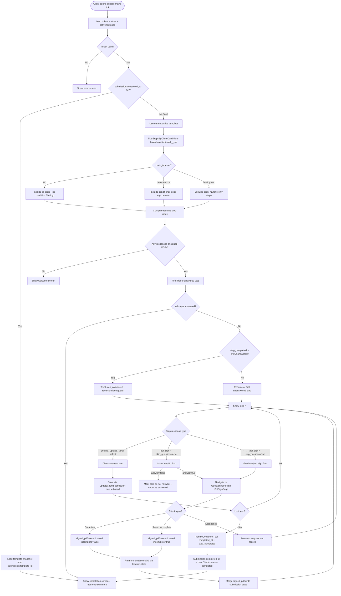
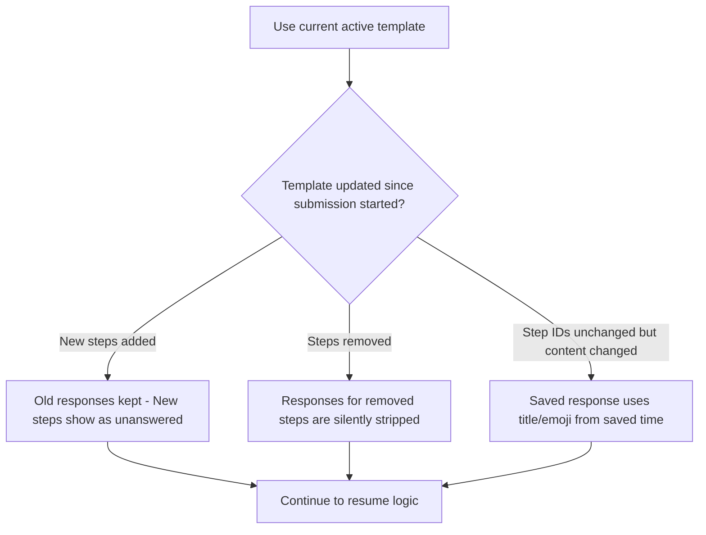
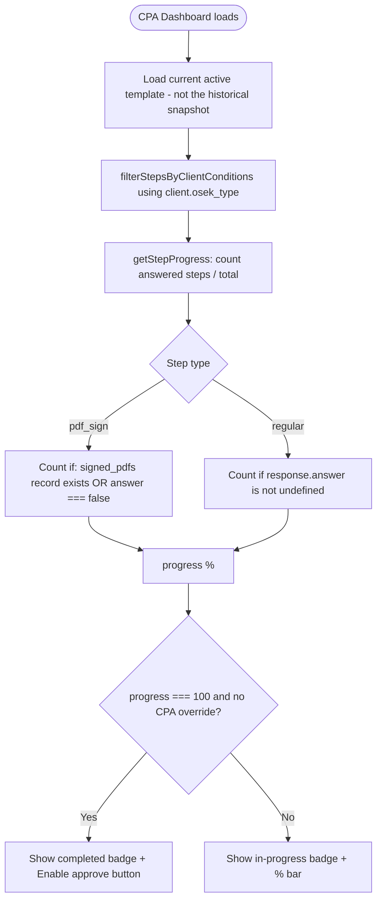
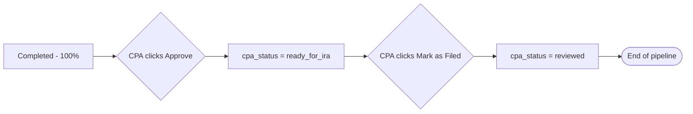

# Questionnaire State Machine — Visual Diagrams

These are the Mermaid diagrams from [QUESTIONNAIRE_STATE_MACHINE.md](file:///c:/Users/ntzur/workspace-antigravity/auditflow/src/docs/QUESTIONNAIRE_STATE_MACHINE.md), rendered as graphics.

---

## Full State Diagram

---

## Template Change Edge Cases

---

## Dashboard Progress Calculation

---

## CPA Status Override Pipeline

